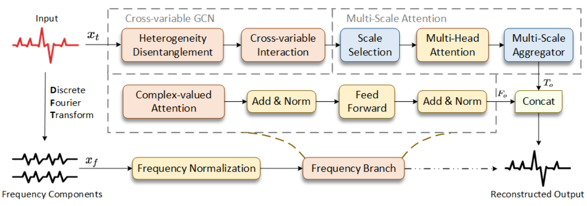

# TFT-GCN: A Time-Frequency Based Model for Time Series Anomaly Detection

This repository contains the official PyTorch implementation of TFT-GCN.



## Repository Organization

```

+---data_provider
|       data_factory.py
|       data_loader.py
|
+---exp
|       exp.py
|       exp_anomaly_detection.py
|       exp_reconstruction.py
|       exp_score.py
|
+---layers
|       ComplexLayers.py
|       Embed.py
|       GCN.py
|       Random_Mask.py
|       SelfAttention.py
|       SelfAttention_Family.py
|       Transformer_EncDec.py
|
+---models
|       model.py
|
+---picture
|       model.png
|
+---scripts
|       all.sh
|       CCFD.sh
|       HAI.sh
|       MSL.sh
|       PSM.sh
|       SKAB.sh
|       SMAP.sh
|       SMD.sh
|       SWaT.sh
|
\---utils
    |   masking.py
    |   print_args.py
    |   tools.py

```

## Requirements

- **Python == 3.9.13**
- **CUDA == 11.8**
- **PyTorch == 2.2.1**
- **PyTorch Geometric == 1.5.0**
- **pandas == 2.0.3**
- **matplotlib == 3.7.5**
- **numpy == 1.24.1**
- **scikit-learn == 1.3.2**
- **scipy == 1.10.1**

## Run

You can run the code using the command within scripts/*.sh. To run the code on SWaT, just run the following command:

```bash

sh ./scripts/SWaT.sh

```

## Citation

TODO